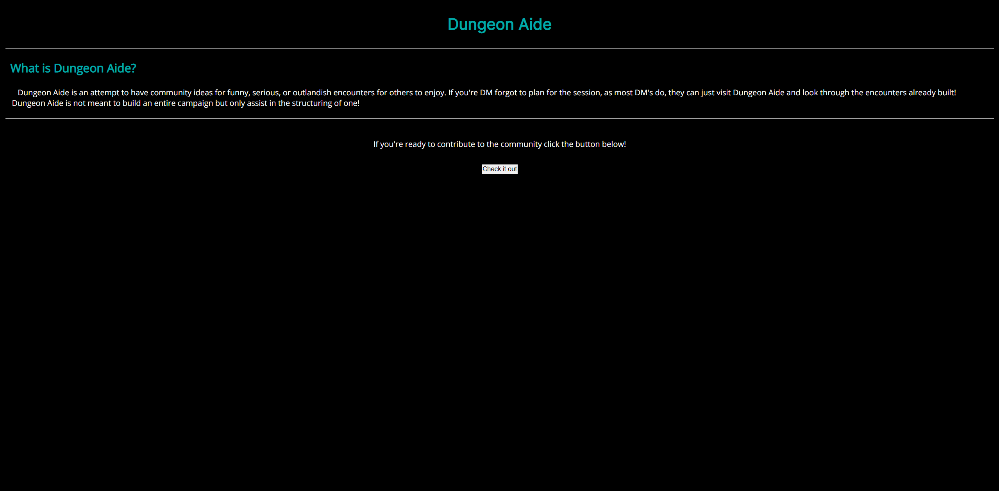
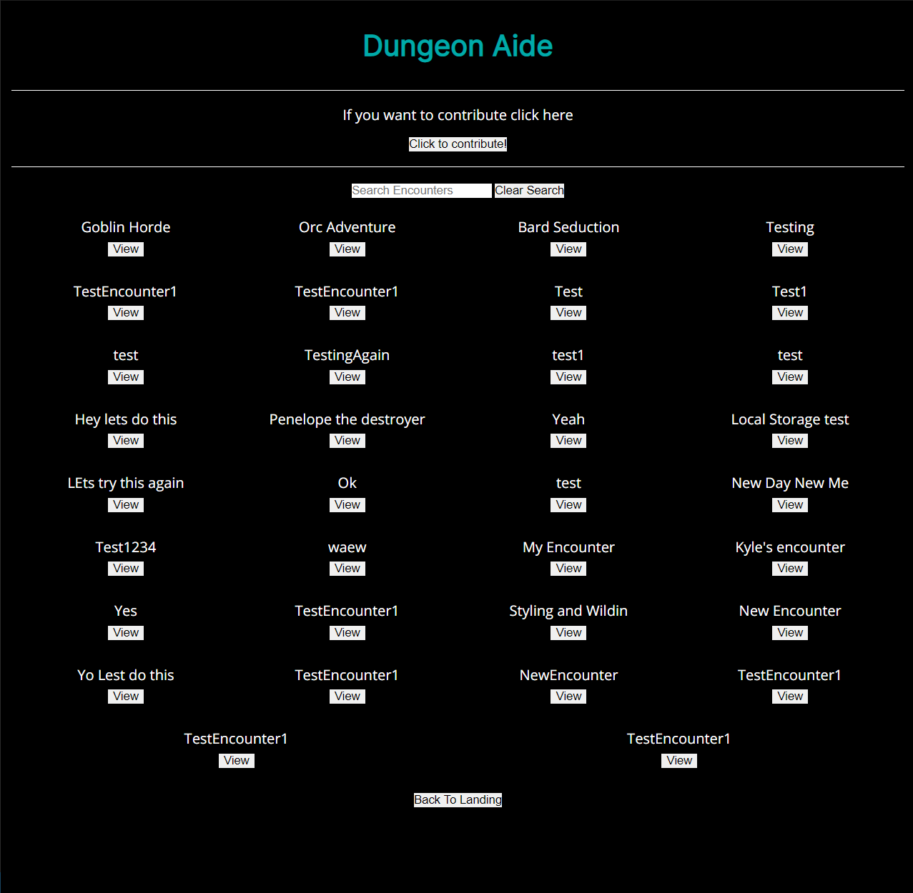
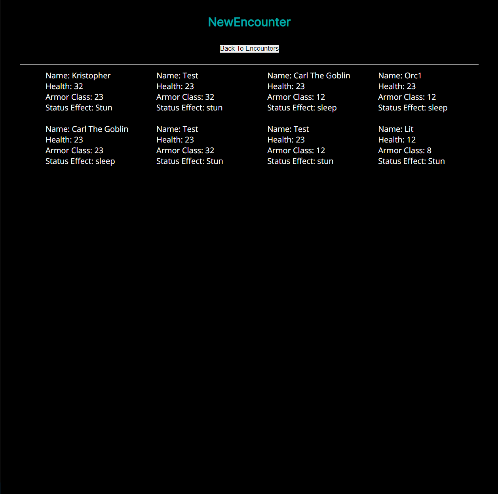
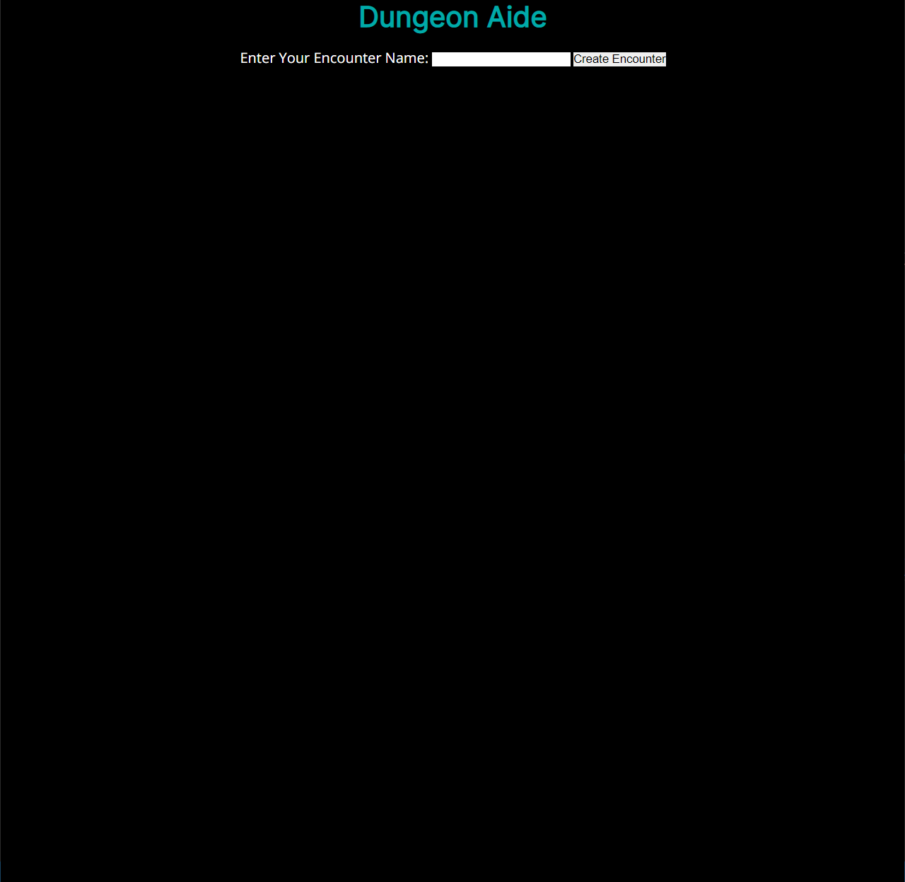
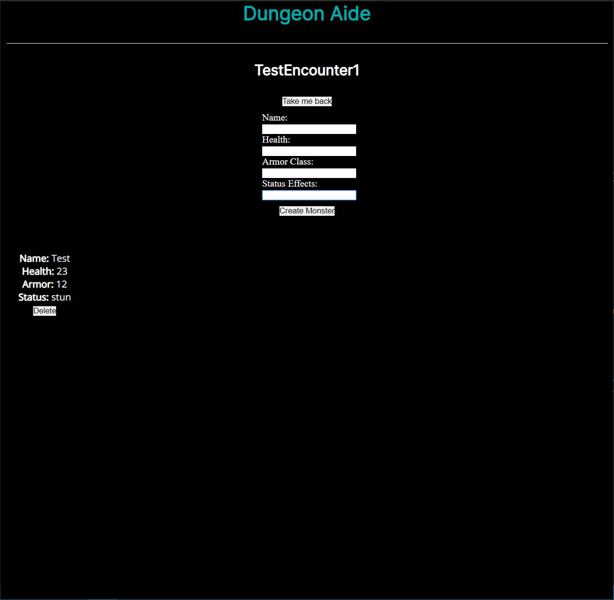

# Dungeon Aide

## Live App
https://dungeon-aide-client.now.sh/

## Documentation

**/api/encounters**

-   GET /api/encounters
-   POST /api/encounters

**/api/monsters**

-   GET /api/monsters/encounter/:encounter_id
-   POST /api/monsters
-   DELETE /api/monsters/:monster_id

## ScreenShots

### LandingPage

### Encounters List

### Specific Encounters

### Encounter Creation

### Monster Creation

## App Summary

Dungeon Aide is an attempt to have community ideas for funny,
serious, or outlandish encounters for others to enjoy. If you're
DM forgot to plan for the session, as most DM's do, they can
just visit Dungeon Aide and look through the encounters
already built! Dungeon Aide is not meant to build an entire
campaign but only assist in the structuring of one!

## Built With

-   React
-   Node
-   Express
-   PostgreSQL

## Road Map

-   Implement User Accounts
-   Users able to manipulate their encounters
-   Links for sharing
-   Saved Favorites
-   Import pictures
